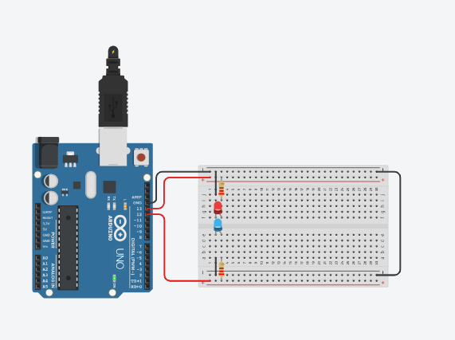

# Manipulando 2 LEDS em paralelo
 Este experimento consiste em fazer com que o LED incorporado e dois LEDs pisquem alternadamente utilizando o pino digital 13 (pino digital incorporado LED_BUILTIN = 13) e o pino digital 12.  
 
## Lista de componentes:

- 1  Arduíno UNO R3
- 1  Um cabo de conexão USB
- 1  Placa de prototipação (Protoboard)
- 2  LED 
- 2  Resistor de 220 Ω ohms
- 5 Jumpers (macho-macho)

## Esquema do projeto

